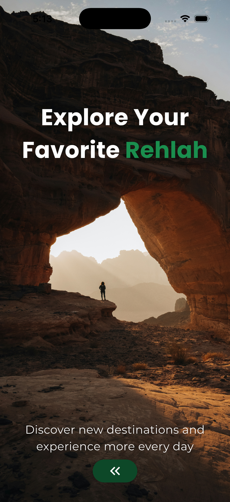
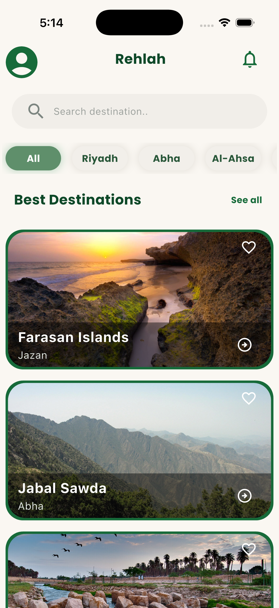
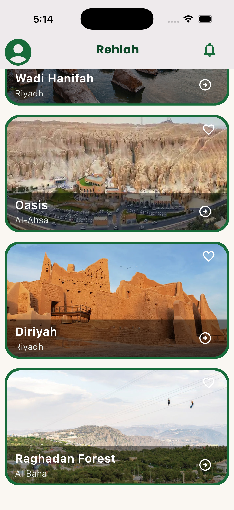
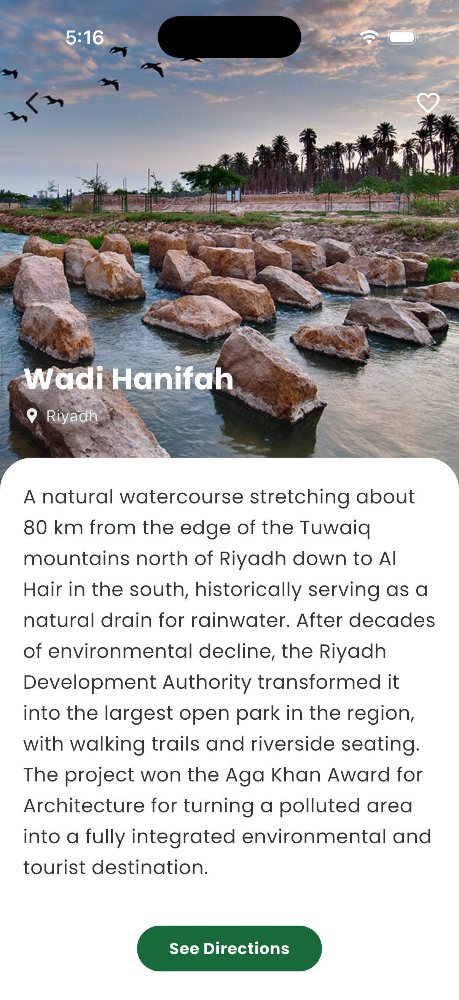

# Rehlah — Saudi Natural Places (Flutter Tourist App)

A Flutter mobile app showcasing Saudi Arabia's most beautiful natural tourist destinations, built for **Flutter Bootcamp — Project 1: UI Implementation**.

## Overview

The app displays a curated list of natural places across Saudi Arabia — mountains, coastlines, oases, and heritage sites — each with an image, name, city, and a detailed description sourced from reliable references. Users can browse the destinations on the home screen and tap into a dedicated details screen for each place.

## Screens

### 1. Intro Screen
A full-screen welcome view with a background image and the headline "Explore Your Favorite **Rehlah**" (the app name highlighted in green), followed by a subtitle and a button leading into the app.



### 2. Home Screen
The main screen — displays the app name ("Rehlah") in the `AppBar`, a search bar, horizontally scrollable city filter chips, and a scrollable list of destination cards. Each card shows the place's image, name, and city, with an explore button that navigates to the details screen.

| | |
|---|---|
|  |  |

### 3. Details Screen
A custom "Screen 2 — Your Choice" implementation: a large hero image with the place name and location overlaid, and a scrollable description panel below.



## Widgets Used

| Widget | Where it's used |
|---|---|
| `AppBar` | Home screen and details screen headers |
| `ListView` | Scrollable list of destination cards on the home screen |
| `Column` | Vertical layout throughout (intro text, card content, details content) |
| `Container` | Cards, search bar, filter chips, image wrappers |
| `SizedBox` | Spacing between images, titles, and cards |
| `Image` | `Image.asset` for all destination photos |
| `Text` | Place names, descriptions, labels |
| `ElevatedButton` / `IconButton` | Intro screen CTA, favorite icon, explore/navigate button on each card |
| `MediaQuery` | Card width and details-screen image height are calculated relative to `MediaQuery.sizeOf(context)` instead of fixed values |
| `Navigator` | Navigation between the intro, home, and details screens |

## Data Structure

Place data is stored as a `List<Map<String, dynamic>>` in `lib/data/places_data.dart`, with each entry containing `name`, `city`, `description`, and `images`.

## Project Structure
lib/
├─ main.dart
├─ data/
│ └─ places_data.dart
└─ screens/
├─ first_screen.dart # Intro screen
├─ second_screen.dart # Home screen
└─ third_screen.dart # Details screen ("Your Choice")
assets/
└─ images/

## Places Featured

- Farasan Islands — Jazan
- Jabal Sawda — Abha
- Wadi Hanifah — Riyadh
- Al-Ahsa Oasis — Al-Ahsa
- At-Turaif District, Diriyah — Riyadh
- Raghadan Forest — Al Baha

## Getting Started

```bash
flutter pub get
flutter run
```

## Author

Hala Alashraf